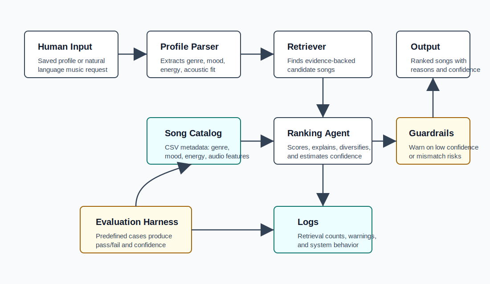

# VibeMatch Applied AI Music Recommender

VibeMatch is an explainable music recommendation system that turns a saved profile or natural-language listening request into ranked song recommendations. It extends a classroom content-based recommender into a small applied AI system with retrieval, an observable agentic workflow, confidence scoring, guardrails, logging, and a repeatable evaluation harness.

## Original Project

This project began as the Module 3 Music Recommender Simulation. The original version loaded a small CSV catalog and ranked songs using simple content-based filtering: genre match, mood match, and energy similarity. It was useful for learning recommender basics, but it had limited reliability checks, no retrieval step, no system trace, and only basic documentation.

## What It Does

Users can choose a preset listener profile or enter a natural-language request such as `chill lofi study music`. The system parses the request, retrieves relevant catalog songs, ranks them with transparent scoring, reports confidence, and flags possible mismatch risks such as low confidence or energy/acoustic mismatch.

## Architecture



Data flows through five main components:

1. Human input supplies either a saved profile or a natural-language request.
2. The profile parser extracts genre, mood, target energy, and acoustic preference.
3. The retriever searches the song catalog for evidence-backed candidates before scoring.
4. The ranking agent scores candidates, diversifies the final list, and explains each result.
5. Guardrails, logs, and the evaluation harness check reliability and make behavior easier to audit.

## AI Features

**Retrieval-Augmented Recommendation:** The recommender retrieves candidate songs from `data/songs.csv` using genre, mood, energy fit, and query-term evidence before generating final recommendations.

**Agentic Workflow:** `recommend_with_context` follows visible steps: validate preferences, retrieve candidates, rank songs, check guardrails, and return a trace of intermediate decisions.

**Reliability System:** `src/evaluate.py` runs predefined cases and prints pass/fail results plus average confidence. The unit tests also cover ranking, prompt parsing, retrieval traces, and evaluation summaries.

## Setup

```bash
python -m venv .venv
source .venv/bin/activate
pip install -r requirements.txt
```

On Windows, activate with:

```bash
.venv\Scripts\activate
```

## Run The App

Launch the interactive dashboard:

```bash
streamlit run src/main.py
```

The dashboard includes saved profiles, natural-language requests, custom profile controls, confidence filtering, recommendation explanations, retrieval traces, reliability results, and a searchable catalog view.

To enable real Spotify catalog recommendations, create a Spotify app and set your credentials before launching:

```bash
export SPOTIFY_CLIENT_ID="your-client-id"
export SPOTIFY_CLIENT_SECRET="your-client-secret"
streamlit run src/main.py
```

Then turn on **Use real Spotify catalog** in the sidebar. The app uses Spotify catalog search, not private user data, so no listener login is required.

Use a saved profile:

```bash
python -m src.main --profile 2 --show-trace
```

Use a natural-language request:

```bash
python -m src.main --query "relaxed acoustic coffee shop jazz" --show-trace
```

Use Spotify from the command line:

```bash
python -m src.main --query "intense rock workout" --spotify --k 3
```

Run the reliability harness:

```bash
python -m src.evaluate
```

Run automated tests:

```bash
pytest
```

## Sample Interactions

### Example 1: Chill Study Request

Input:

```bash
python -m src.main --query "chill lofi study music" --show-trace
```

Expected output summary:

```text
Parsed request: chill lofi study music
Profile: genre=lofi, mood=chill, energy=0.35, acoustic=True
Retrieved evidence:
- Library Rain: catalog genre=lofi; catalog mood=chill; energy is close to target
- Midnight Coding: catalog genre=lofi; catalog mood=chill; energy is close to target

Top recommendations:
Title: Library Rain by Paper Lanterns
Score: high match | Confidence: high
Reasons include exact genre, exact mood, energy similarity, acoustic fit, and retrieval evidence.
```

### Example 2: Workout Request

Input:

```bash
python -m src.main --query "intense rock workout" --show-trace
```

Expected output summary:

```text
Profile: genre=rock, mood=intense, energy=0.90, acoustic=False
Top recommendations include Storm Runner and Thunder Storm, with reasons based on intense mood,
high energy, and rock/metal genre evidence.
```

### Example 3: Reliability Evaluation

Input:

```bash
python -m src.evaluate
```

Current result:

```text
VibeMatch reliability evaluation
Passed: 5 / 5
Average confidence: 0.78
```

## Design Decisions

I used transparent scoring instead of a black-box model because the dataset is small and the project needs clear explanations. Retrieval is based on song metadata and query evidence, which makes it easy to inspect why a song was considered. Confidence is calculated from the final score, so it is not a perfect probability, but it gives a useful warning signal when the match is weak.

The system also diversifies recommendations when possible. This reduces genre lock-in, but it can slightly lower the score of the last few results. I chose that trade-off because a music recommender should support discovery, not only repeat the narrowest possible match.

## Testing Summary

The test suite covers:

- Original recommender sorting behavior.
- Non-empty recommendation explanations.
- Agent trace, retrieval, confidence, and guardrail structure.
- Natural-language prompt parsing.
- Evaluation harness pass/fail summaries.

The reliability harness currently passes 5 out of 5 predefined cases. The hardest case is an unknown genre request, where the system must fall back to adjacent mood and acoustic evidence while warning that the requested genre is not represented.

## Limitations And Ethics

The catalog is tiny, so the system can overrepresent genres that happen to have more rows. Metadata labels such as mood and genre are subjective, and different listeners may disagree with them. The confidence score measures fit to the system's rules, not true human satisfaction.

This system could be misused if it claimed to know a person's real identity, emotions, or mental health from music preferences. To prevent that, VibeMatch only uses explicit user input and catalog metadata, and its explanations stay focused on music features.

Testing surprised me because adjacent genres improved discovery, but they also made evaluation more complex. A recommendation can be technically different from the requested genre and still be useful, so the tests check acceptable genre and mood families rather than exact matches only.

## AI Collaboration Reflection

AI was helpful in suggesting that a simple recommender could become more professional by adding a traceable workflow, confidence scoring, and evaluation cases. A flawed suggestion was to treat the confidence score like a statistical probability; I corrected that by documenting it as a rule-based fit score rather than a true probability.

## Demo Walkthrough

Loom video link: add your recording link here after recording the required 2-3 end-to-end examples.

Suggested video flow:

1. Run `python -m src.main --profile 2 --show-trace`.
2. Run `python -m src.main --query "intense rock workout" --show-trace`.
3. Run `python -m src.evaluate` to show reliability behavior.

## Portfolio Artifact

This project shows that I can turn a simple prototype into a more complete AI system: one with retrieval, reasoning steps, testing, guardrails, and documentation. As an AI engineer, it represents my ability to build systems that are not only functional, but also explainable and responsible.
